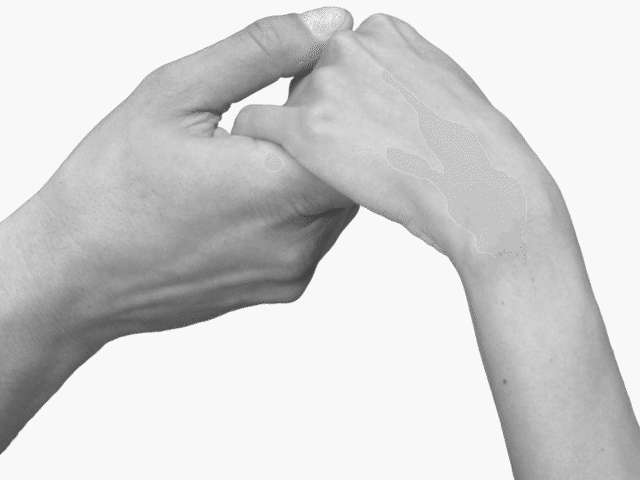
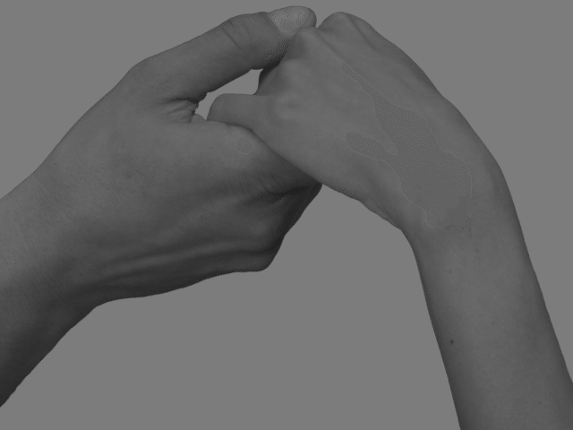

# ft_contrast
hands.pgm             |  contrasted_hands.pgm
:-------------------------:|:-------------------------:
  |  

ft_contrast is a 42 rush project (project realised on a week-end) consisting in building a threadpool library and three different programs applying a contrast on a picture.

| Program   | Description |
| -------- | -------------- |
| ft_contrast  | A simple contrast program             |
| ft_contrast_th  | A contrast program using multithreading             |
| ft_contrast_tp  | A contrast program using the multithreading pool (from tpool library)            |

libtpool has three different functions to create a threadpool, add tasks and wait for all the tasks to be done.

```
t_tpool		*tp_create(int nb_threads);
void			tp_exec_queue_add(void *args, void (*func)(void*));
void			tp_wait_for_queue(void);
```
